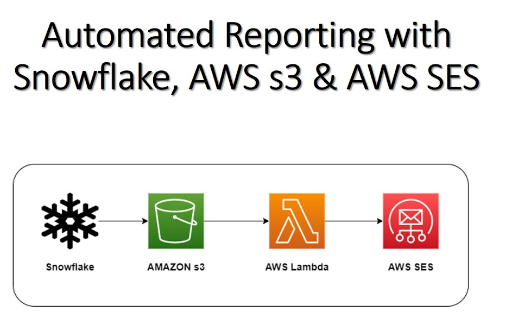
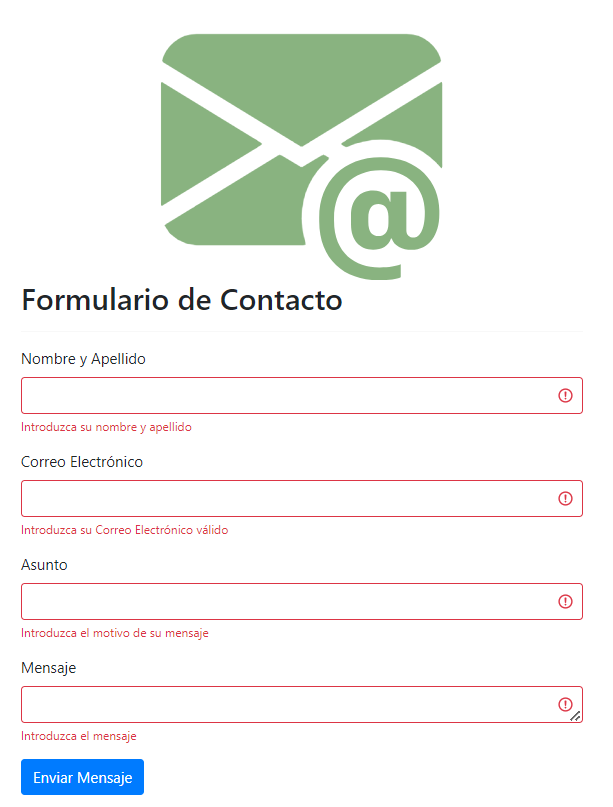

# Proyecto de Envío de Mails con Django.
<br></br>
<p align="center">
  
</p>

## Índice.
1. [Descripción del Proyecto](#descripción-del-proyecto)
2. [Arquitectura del Proyecto](#arquitectura-del-proyecto)
3. [Tecnologías Utilizadas](#tecnologías-utilizadas)
4. [Camino de los Datos](#camino-de-los-datos)
5. [Rendimiento del Script](#rendimiento-del-script)
6. [Comparación entre Computadora Local y Servicios en la Nube](#comparación-entre-computadora-local-y-servicios-en-la-nube)
7. [Mejoras Futuras](#mejoras-futuras)
8. [Conclusión](#conclusión)

## 1. Descripción del Proyecto.
Este proyecto se enfoca en el envío de correos electrónicos utilizando el framework Django. Su objetivo principal es demostrar habilidades en el manejo de datos y el uso de tecnologías modernas para automatizar procesos, en este caso, el envío de emails. Esta funcionalidad es crucial en aplicaciones laborales e industriales, donde la automatización de comunicaciones puede ahorrar tiempo y mejorar la eficiencia.


## 2. Arquitectura del Proyecto.
El proyecto sigue una estructura de directorios típica de Django:


```plaintext
├── core/
│   ├── __init__.py
│   ├── admin.py
│   ├── apps.py
│   ├── migrations/
│   ├── models.py
│   ├── tests.py
│   ├── urls.py
│   ├── views.py
│
├── emails/
│   ├── __init__.py
│   ├── asgi.py
│   ├── settings.py
│   ├── urls.py
│   ├── wsgi.py
│
├── templates/
│   ├── base.html
│   ├── email-template.html
│   ├── index.html
│
├── db.sqlite3
├── manage.py
└── requirements.txt

```


## 3.Tecnologías Utilizadas.
Este proyecto hace uso de varias tecnologías y bibliotecas. A continuación, una tabla detallada:

| Tecnología        | Tipo             | Descripción                           |
|-------------------|------------------|---------------------------------------|
| Django            | Framework        | Framework web utilizado para el backend y la lógica de negocios. |
| Python            | Lenguaje         | Lenguaje de programación utilizado.   |
| SQLite            | Base de Datos    | Base de datos ligera para el almacenamiento de datos. |
| Bootstrap         | Librería CSS     | Librería para el diseño y estilo de la interfaz de usuario. |
| Gmail SMTP Server | Servicio         | Servicio para el envío de correos electrónicos. |

<p align="center">
  
</p>

## 4. Camino de los Datos.
El camino de los datos en este proyecto sigue el proceso ETL (Extract, Transform, Load), común en la ingeniería de datos.

| Etapa        | Descripción                                                                                |
|--------------|--------------------------------------------------------------------------------------------|
| **Extract**  | Extracción de datos del formulario de contacto enviado por el usuario.                      |
| **Transform**| Transformación de los datos en un formato adecuado para el envío de correos electrónicos.  |
| **Load**     | Envío del correo electrónico utilizando el servidor SMTP configurado.                      |

Este proceso es manejado por la arquitectura Model-View-Template de Django:
- **Model**: Gestiona la lógica de datos y las reglas de negocio.
- **View**: Controla la lógica de la aplicación y maneja las solicitudes y respuestas.
- **Template**: Define la presentación y la interfaz de usuario.


<p align="center">
  
</p>

## 5. Rendimiento del Script.
El rendimiento del script ha sido probado en una computadora con las siguientes especificaciones:
- **Procesador**: Intel Core i7
- **Tiempo de ejecución**: Aproximadamente 2 segundos para enviar un correo electrónico.

Para comparar, alojar este proceso en un servicio de nube como AWS podría tener costos asociados tanto al procesamiento como al almacenamiento de información. Por ejemplo, utilizando Amazon SES (Simple Email Service), los costos de envío de emails son bastante bajos y escalables según la cantidad de correos enviados.

## 6. Comparación entre Computadora Local y Servicios en la Nube.
| Característica            | Computadora Local                      | Servicio en la Nube (AWS)           |
|---------------------------|----------------------------------------|-------------------------------------|
| **Costo**                 | Costo inicial de hardware              | Pago por uso (bajo demanda)         |
| **Escalabilidad**         | Limitada al hardware disponible         | Altamente escalable                 |
| **Mantenimiento**         | Requiere mantenimiento manual          | Mantenimiento gestionado por AWS    |
| **Seguridad**             | Depende de las configuraciones locales | Seguridad gestionada por AWS        |

<p align="center">
  
</p>

## 7. Mejoras Futuras.
El proyecto puede mejorarse e integrarse con otras tecnologías para expandir su funcionalidad:
- Integración con **AWS SES** para el envío de correos electrónicos.
- Uso de **APIs RESTful** para permitir la interacción con otras aplicaciones.
- Implementación de **workflow automation** para tareas repetitivas.
- Mejora de la **interfaz de usuario** utilizando frameworks modernos como **React** o **Vue.js**.
- Incorporación de **análisis de datos** para rastrear y medir el rendimiento de los envíos de correos.

## 8 Conclusión.
Este proyecto demuestra la capacidad de utilizar Django para crear aplicaciones web funcionales y eficientes, en este caso, para el envío de correos electrónicos. Con futuras mejoras e integraciones, este proyecto puede ser una herramienta poderosa en diversos contextos laborales e industriales.


<p align="center">
  
</p>